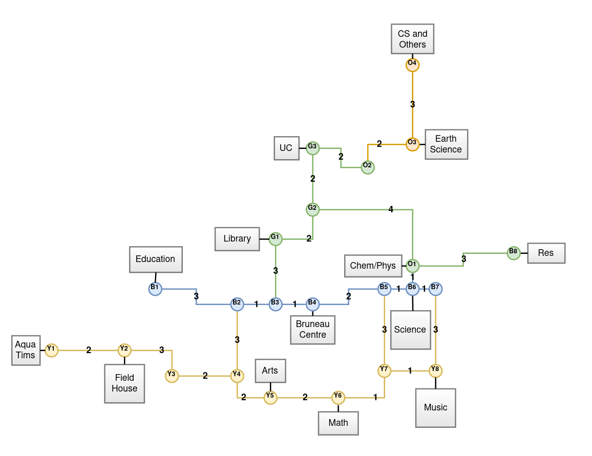

# 10 Minutes

Thanks to the work completed by [Messy Banner](../messybanner), invalid data was removed from the banner system.

However, the data for courses being offered next semester doesn't account for the distance between classes.

Even though we're given _10 minutes_ between classes, you've been brought back find the shortest path between different buildings / classes.



Above is a simplified view of paths / tunnels between classes, along with each 'weight' of the paths, since not all paths are as short/long.

(Also of note is O1 and B8 being a little lost, they made more sense when there was a overpass between Chem/Phys and Earth Science .-.)

You can assume that students will only be taking them and not other alternate routes.

You also want to give your own opinion on how 'good' the path is.

If the 'weights' between each location less than or equal to 5, you think that's pretty "Short!".

If they're less than or equal 15, you still think that's "Okay".

Anything other than that is for sure too "Long :(".

To remove the tedious task of turning the above image into data, [that's already done for you in this file!](./10mins.json)

## Input

Two locations, one on each line.

## Output

The path between the two locations, delimited with " -> ", and inclusive to the locations themselves, along with your opinion on the length.

## Sample

**Input:**

```
CS and Others
Aqua Tims
```

**Output:**

```
CS and Others -> O4 -> O3 -> O2 -> G3 -> G2 -> G1 -> B3 -> B2 -> Y4 -> Y3 -> Y2 -> Y1 -> Aqua Tims
Long :(
```

---

**Input:**

```
Music
Arts
```

**Output:**

```
Music -> Y8 -> Y7 -> Y6 -> Y5 -> Arts
Short!
```

---

**Input:**

```
Res
Education
```

**Output:**

```
Res -> B8 -> O1 -> B6 -> B5 -> B4 -> B3 -> B2 -> B1 -> Education
Okay
```

### Generate all possible start/end points

The following Python code (tested using: 3.8.1) will populate the `./test-data` directory with plenty of test files.

```python
import json
from itertools import permutations

with open("10mins.json") as json_file:
    data = json.load(json_file)
    locations = data.keys()
    perms = list(permutations(locations, 2))
    for index, perm in enumerate(perms):
        with open(f"./test-data/{index}.in", "x") as f:
            f.write(f"{perm[0]}\n{perm[1]}\n")
```

## Bonus: *_Speed_*

Once all the submissions are in, the above generated test data will be ran against the following shell script:

```sh
#!/usr/bin/env sh

process_cases() {
    for case in $( find ./test-data/*.in )
    do
        cat "$case" | <YOUR PROGRAM HERE>
    done
}

time process_cases
```

Try and see if you can get the fastest time!
